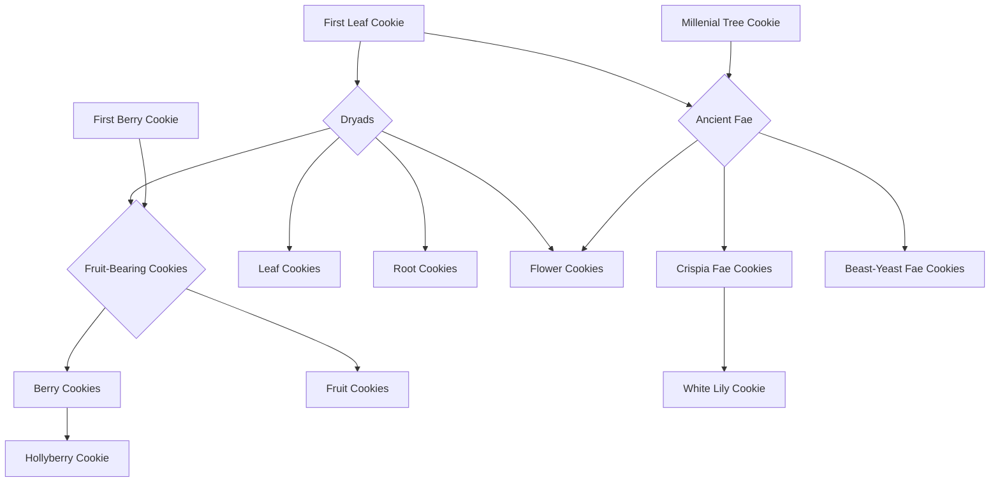
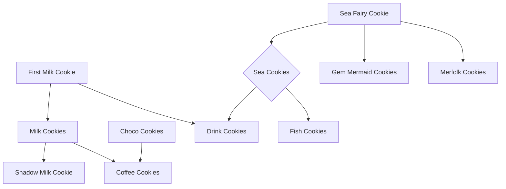
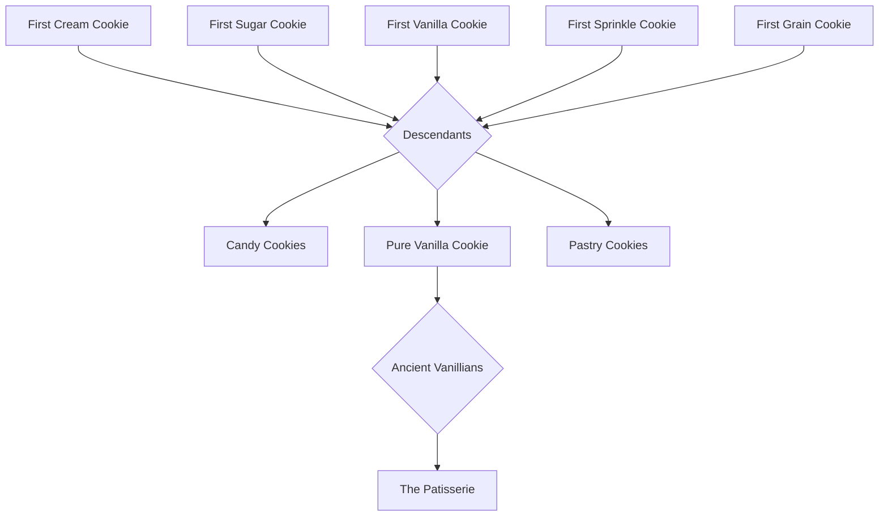
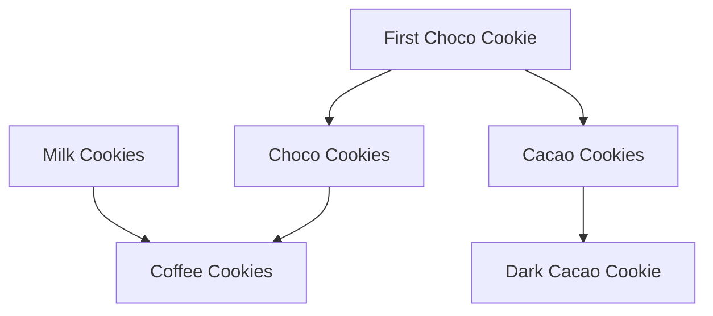
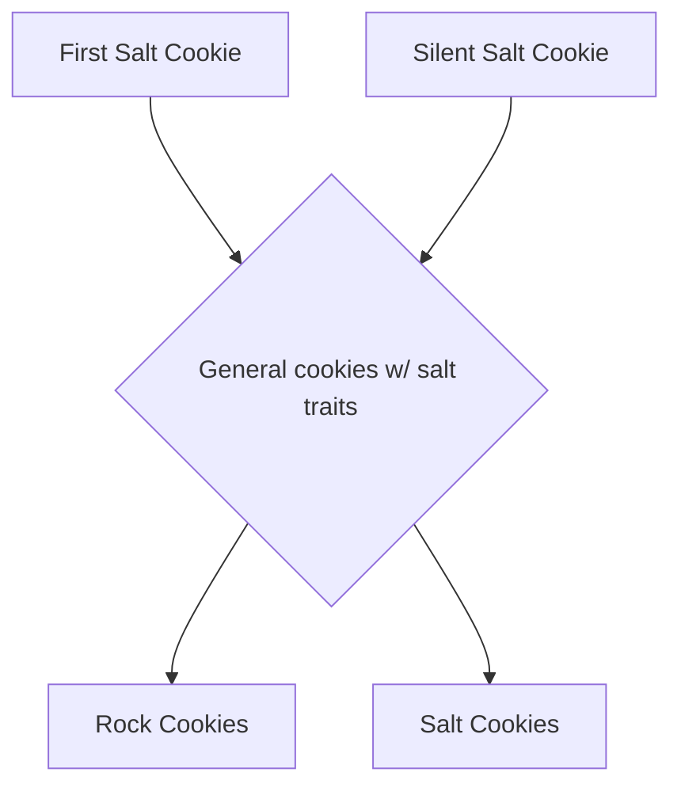
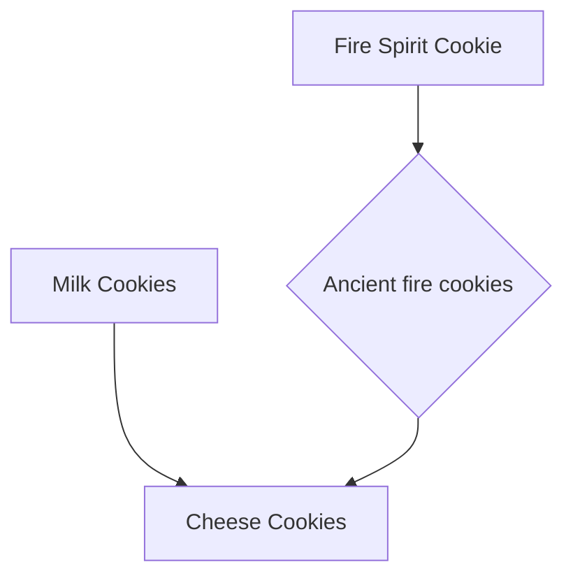
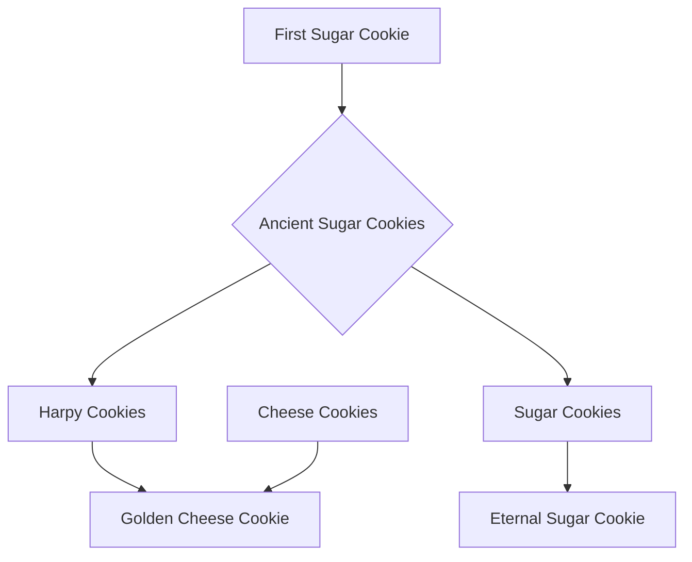
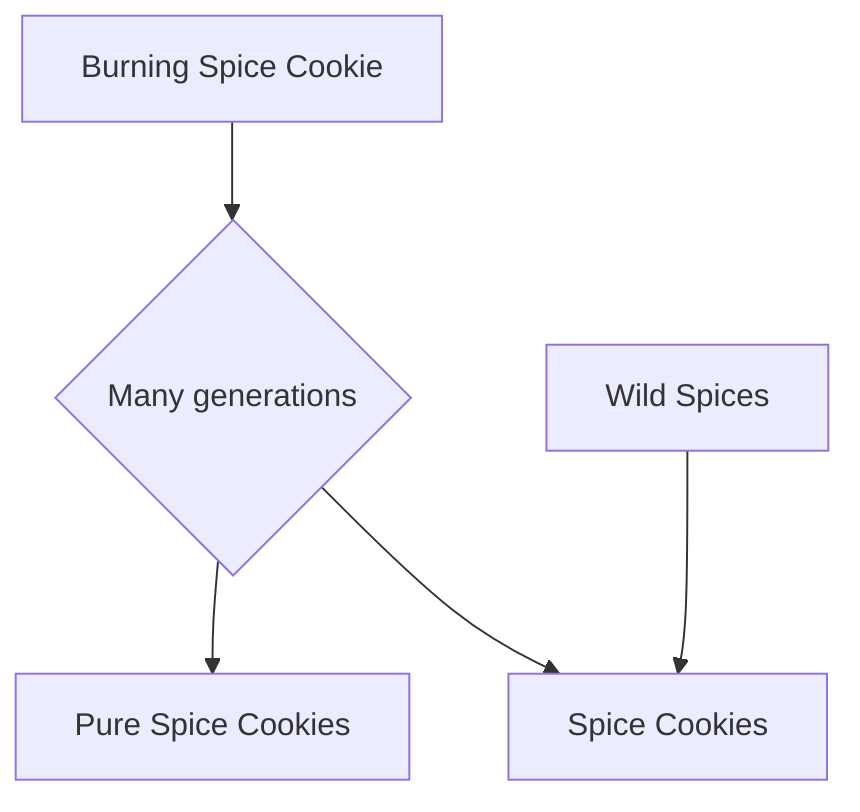
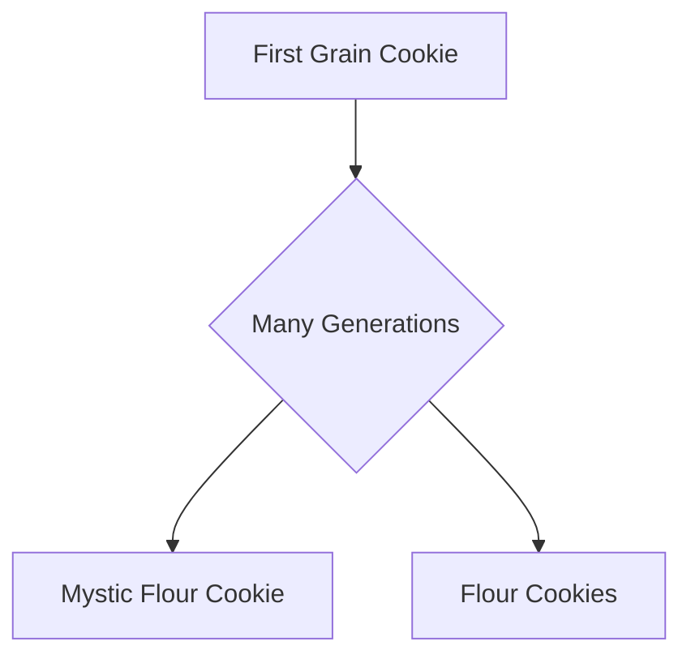

---
{"dg-publish":true,"permalink":"/cookies/","dg-note-properties":{}}
---

Cookies are not really actually cookies, but the naming scheme for basically everything they have is cookie-themed. Biologically, cookies are magic organisms with blood (jam), bones, organs...

Cookies are a cursed form of Human, having the anatomy of such and fake magic replicas of their bodily features. This is why they often don't take the name of the real features, like how blood is jam, or how hair can be called frosting.

Cookies can be created in two ways;
- Naturally, via birth. This is when two cookies reproduce biologically. The process is identical to humans.
- Artifically, via magic. This is when a Human or one harnessing their power creates a Cookie. These Cookies can be aracial, and every Cookie created by a Human bares that Human's mark of creation.

Every Cookie has a Soulstone, which is functionally their heart. There are 9 possible Soulstones, each increasing in rarity.

A Cookie's Soulstone determines their capability for magic and power. Rarity is genetic, though a high majority of cookies are not aware of their Soulstones, nor their bloodline's. The highest rarity Soulstone a Cookie could be born with is Super Epic. A high majority of Cookies have Common or Rare Soulstones.
- Dragon Soulstones belong to the Dragons, and therefor can only be inherited by being the offspring of a Dragon.
- Legendary Soulstones arise from beings that are in some way inhuman, a Cookie with mortal blood cannot be Legendary.
- Ancient Soulstones belong to the Five Ancients.
- Beast Soulstones belong to the Five Beasts.
- There is a ninth Soulstone, that being Witch.

There are four biological sexes for Cookies. Nobody exactly knows why, but a Cookie is more likely to be the sex of one of their parents then not. While Cookies do biologically reproduce, science and the harnessing of ancient Human magic has made it not only possible but easy and normalized for a pairing that cannot biologically reproduce to do so. Cookies can be Male, Female, Absent (completely hormonally balanced, no reproductive organs), and Ambigenous. (can range in hormonal composition, both reproductive organs). All four are generally equally common, though certain sexes are more common in certain flavors.

Cookies come in many flavors, though they can be split into some major categories.
## Unflavored Cookies

Unflavored Cookies can only be created by a Human or by Human magic. Or, theoretically, if two unflavored Cookies had a child. The Cookies created by Witches and Wizards in the beginning were all unflavored. It wasn't until they became the First Cookies that flavors began. This is how entire flavors descend from a single cookie.

(In every tree, it is implied that unflavored cookies are a part of the process.)

Any cookie will inherit a flavor if possible, it is impossible to be unflavored if either parent has any semblance of flavor.

Example:

## Fae Cookies, Plant Cookies, and Fruit-Bearing Cookies

Examples:
(Beast-Yeast Fae)

Beast-Yeast Fae look more like Ancient Fae, retaining almost the exact same traits. Their skin is a hardened exo-skeleton, made of the same material that the Silver Tree is made of. They are gray with iridescent yellows, pinks, and blues.

Most Beast-Yeast Fae are either Absent or Ambigenous, very rare are they Male or Female.
(Crispia Fae)

Crispia Fae arrived in Crispia not very long ago. While a majority of their skin is still hardened, it has become more like soft wood, and they come in much more vibrant colors. They often carry flower and fruit traits.

Similar to Beast-Yeast Fae, most Crispia Fae are Absent or Ambigenous, though Male and Female Fae are somewhat more common.

(Berry Cookies)

Both Berry and Fruit Cookies have the capacity to grow fruit (other then their hair) and leaves. The difference is that Berry Cookies always grow leaves alongside their berries, while Fruit Cookies can very optionally grow leaves or fruit.

Berry Cookies often have darker skin than Fruit Cookies, and Fruit Cookies have skin that can tint a lot more unnaturally than Berry Cookies. Fruit Cookies often have round and puffy hair, while Berry Cookies have more natural hair that clumps into berry-like shapes.

(Fruit Cookies)

## Sea Cookies and Drink Cookies

Examples:

Drink Cookies have hair that is soft and drippy, made out of some kind of liquid substance, as well as gills on their cheeks and necks. Drinks have pointed ears while Milk and Coffee Cookies have rounded ears, with Milk Cookies having longer floppier ears. Milk Cookies also have soft liquid-like hair, but it's more gelatinous. Coffee Cookies have slightly smoother and shinier hair than Choco Cookies.

Milk and Coffee Cookies have pure black pupils.

Drink Cookies also have parts of their body that consist of liquid, not skin. This is commonly only small portions, but at its rarest, it can be the entire body below the neck.
## Desert Cookies

Examples:

Cookies directly descending from Pure Vanilla Cookie often have lighter skin and white, sometimes cream colored hair. On the other hand, other Pastry Cookies will have darker skin and hair, and they can often have a larger variety of colors.
## Chocolate Cookies

Examples:

Cacao and Choco cookies are very similar, though with some slight differences. Cacao hair is usually completely black, rarely with white streaks, though that's more a trait in the royal family exclusively. Cacao cookies are usually darker as well. Their eyes are usually a dark vibrant color, purple red or orange.

Choco cookies are slightly lighter, and their hair much more commonly has streaks that are more likely colored rather than white. Their eyes 90% of the time are black, not colored. Their hair can also be lighter, sometimes being a beige or brown color rather than black.
## Salt Cookies

Examples:

Salt and Rock Cookies are very similar. Both have two striking features: Hair made of stone and pupil-less eyes. The main difference is that Salt Cookies are entirely pale, while Rock Cookies are bright and colorful.
## Cheese Cookies

Examples:

Cheese Cookies always have some kind of yellow or pale hair, usually soft or kinked, and they commonly have colored markings on their body.
## Harpy Cookies and Sugar Cookies

Examples:

While Harpy and Sugar Cookies both have sugary silk-like hair and feathers, Harpy Cookies have drifted over time to be lesser and smaller than Sugar Cookies. As well as this, Sugar Cookies always have three sets of wings, and Harpy Cookies have two. (Can vary in placement.)

Sugar Cookies are almost always some shade of pink, purple, or red. Harpy Cookies on the other hand can be any color, but their skin must be a shade of brown or peach. Sugar Cookies always have a halo of some kind, and Harpy Cookies do not.
## Spice Cookies

Examples:
(Spice Cookies)

(Pure Spice Cookies)

Pure Spice Cookies are much more directly related to Burning Spice Cookie, having names such as '___ Spice Cookie'. Regular Spice Cookies, on the other hand, are the more common kind. A majority of them are descendants of both Cookies and Wild Spices.

Pure Spice Cookies often have a red antennae. Their ears can be furred or bare, more often furred then not. Spice Cookies can be a range of colors, but Pure Spice Cookies are often only red, sometimes with black markings.

## Flour Cookies

Examples:

Flour Cookies have pale soft dough with hair either slightly darker or the same as their skin. Their sclera are black and their pupils are white.