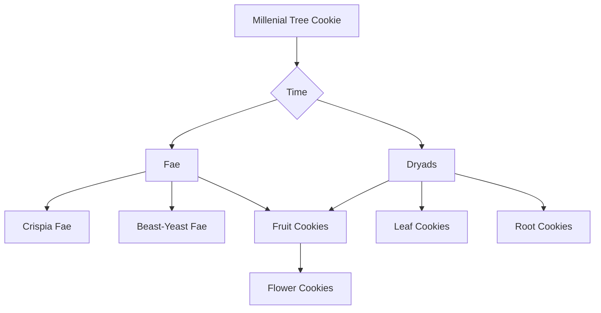

---
{"dg-publish":true,"permalink":"/cookies/","dg-note-properties":{}}
---

Cookies are not really actually cookies, but the naming scheme for basically everything they have is cookie-themed. Biologically, cookies are magic organisms with blood (jam), bones, organs...

Cookies are a cursed form of Human, having the anatomy of such and fake magic replicas of their bodily features. This is why they often don't take the name of the real features, like how blood is jam, or how hair can be called frosting.

Cookies can be created in two ways;
- Naturally, via birth. This is when two cookies reproduce biologically. The process is identical to humans.
- Artifically, via magic. This is when a Human or one harnessing their power creates a Cookie. These Cookies can be aracial, and every Cookie created by a Human bares that Human's mark of creation.

Every Cookie has a Soulstone, which is functionally their heart. There are 9 possible Soulstones, each increasing in rarity.

A Cookie's Soulstone determines their capability for magic and power. Rarity is genetic, though a high majority of cookies are not aware of their Soulstones, nor their bloodline's. The highest rarity Soulstone a Cookie could be born with is Super Epic. A high majority of Cookies have Common or Rare Soulstones.
- Dragon Soulstones belong to the Dragons, and therefor can only be inherited by being the offspring of a Dragon.
- Legendary Soulstones arise from beings that are in some way inhuman, a Cookie with mortal blood cannot be Legendary.
- Ancient Soulstones belong to the Five Ancients.
- Beast Soulstones belong to the Five Beasts.
- There is a ninth Soulstone, that being Witch.

Cookies come in many races, though they can be split into some major categories.
# Plant Cookies

